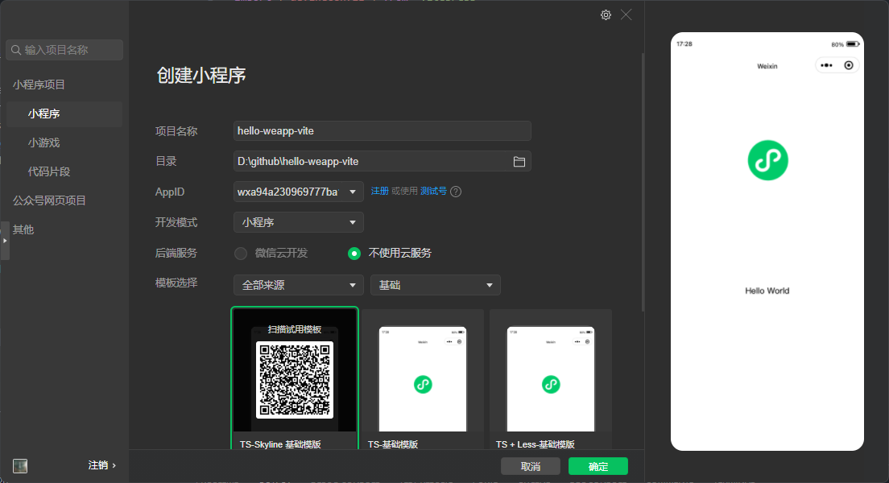

# 快速开始 {#getting-started}

> [!IMPORTANT]
> 在使用前，请确保你安装了 `Nodejs` 且版本 `>=20.5.0 || >=18.18.0`
>
> 推荐使用 [Nodejs 官网](https://nodejs.org/) 上的 `LTS` 版本

## 使用方式

### 创建项目

打开微信开发者工具, 点击 `+` 创建一个项目，依次选择 `开发模式: 小程序` , `后端服务: 不使用云服务`, `模板选择: 第二项选择 基础`, 选择 `JS` 基础模板

> 使用 `JS` 基础模板创建项目，依然可以使用 `Typescript`



> 假如你创建的是一个 `TS` 模板项目，你需要在 `vite.config.ts` 里的 `weapp.srcRoot` 配置项，指明使用的是 `'./miniprogram'` 目录，详见本页下方

### 初始化安装

然后在项目根目录，执行初始化命令：

```sh
# 执行初始化命令
npx weapp-vite init
```

于是就初始化成功了！然后再执行一下安装包的命令

```sh
# npm
npm i
# yarn
yarn
# pnpm
pnpm i
```

这样微信开发小程序的智能提示(`types`)，也都被安装进来

## typescript / sass / less 等的默认支持

你可以直接使用 `typescript`，把 `js` 改成 `ts` 后缀即可，也可以通过安装 `sass` / `less`，并把 `index.wxss` 的后缀名改成相应的后缀来支持样式预处理器，比如 `scss` / `less` 。

### 开发命令

```sh
npm run dev
```

此时会启动 **1到多个** `fs.watcher` 对项目进行监听，发生更改就重新打包编译，并输出到 `dist` 目录

### 构建命令

```sh
npm run build
```

此时会启用 `vite` 自带的 `build` 模式，删除整个 `dist` 目录重新生成，并进行代码压缩

### 打开微信开发者工具命令

```sh
npm run open
```

使用这个命令直接打开微信开发者工具

## 简易配置项

> 假如你是用微信开发者工具创建的 `typescript` 模板项目，那么你需要设置 `srcRoot: './miniprogram'`

配置项可以与 `vite` 通用，同时加入了 `weapp-vite` 的扩展:

`vite.config.[m]ts`:

```ts
import { defineConfig } from 'weapp-vite/config'

export default defineConfig({
  // 其他的配置同
  weapp: {
    // 用来配置监听 app.json 所在的目录
    // 比如默认情况下 ts 创建的项目，app.json 所在为 './miniprogram'
    srcRoot: './miniprogram',
    // other weapp-vite options
  },
})
```

你可以在 `defineConfig` 使用其他的 `vite` 插件，比如 `weapp-tailwindcss`

[查看更多的配置列表](/config/)

当然还有更多更强的功能，正在等待你的探索，让我们赶紧进入下一章吧
